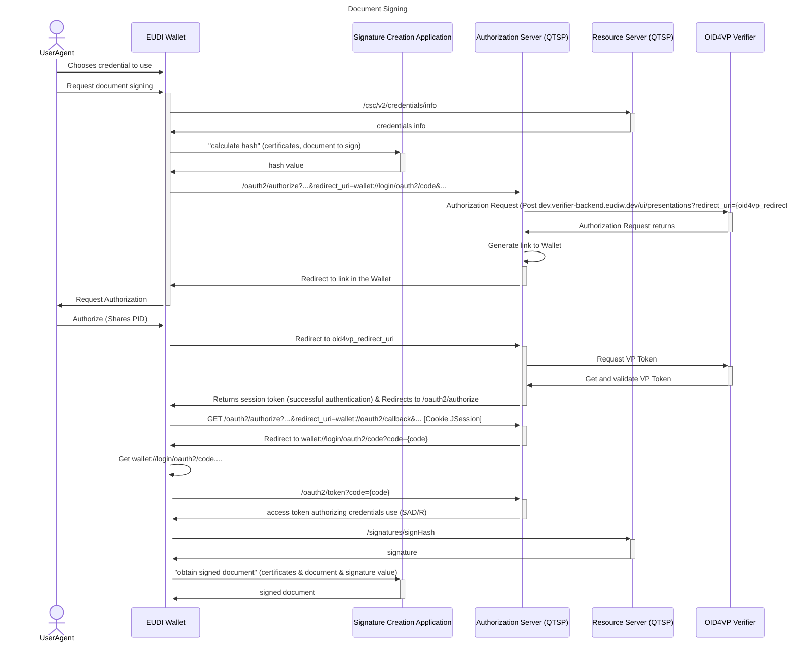

# EUDI Wallet-driven external SCA

[](https://www.apache.org/licenses/LICENSE-2.0)

:heavy_exclamation_mark: **Important!** Before you proceed, please read
the [EUDI Wallet Reference Implementation project description](https://github.com/eu-digital-identity-wallet/.github/blob/main/profile/reference-implementation.md)

## Table of contents

- [EUDI Wallet-driven external SCA](#eudi-wallet-driven-external-sca)
    - [Table of contents](#table-of-contents)
    - [Overview](#overview)
    - [Disclaimer](#disclaimer)
    - [Sequence Diagrams](#sequence-diagrams)
        - [Credential Authorization](#credential-authorization)
    - [Endpoints](#endpoints)
    - [Deployment](#deployment)
        - [Requirements](#requirements)
    - [How to contribute](#how-to-contribute)
    - [License](#license)
        - [Third-party component licenses](#third-party-component-licenses)
        - [License details](#license-details)


## Overview

This is a REST API server that implements the wallet-driven SCA for the remote Qualified Electronic Signature component of the EUDI Wallet.
The SCA provides endpoints that allow to calculate the hash value of a document and obtained the signed document given the signature value.

Currently, the server is running at "https://walletcentric.signer.eudiw.dev", but you can [deploy](#deployment) it in your environment.

## Disclaimer

The released software is an initial development release version:

-   The initial development release is an early endeavor reflecting the efforts of a short timeboxed
    period, and by no means can be considered as the final product.
-   The initial development release may be changed substantially over time, might introduce new
    features but also may change or remove existing ones, potentially breaking compatibility with your
    existing code.
-   The initial development release is limited in functional scope.
-   The initial development release may contain errors or design flaws and other problems that could
    cause system or other failures and data loss.
-   The initial development release has reduced security, privacy, availability, and reliability
    standards relative to future releases. This could make the software slower, less reliable, or more
    vulnerable to attacks than mature software.
-   The initial development release is not yet comprehensively documented.
-   Users of the software must perform sufficient engineering and additional testing in order to
    properly evaluate their application and determine whether any of the open-sourced components is
    suitable for use in that application.
-   We strongly recommend not putting this version of the software into production use.
-   Only the latest version of the software will be supported

## Sequence Diagrams

### Credential Authorization



## Endpoints

### Calculate Hash Endpoint

* Method: POST
* URL: http://localhost:8086/signatures/calculate_hash

This endpoint calculates the digest value of a given document.
The payload of this request is a JSON object with the following attributes:
* **documents**: a JSON array consisting of JSON objects, where each object contains a base64-encoded document content to be signed and additional request parameters.
* **endEntityCertificate**: the base64-encoded certificate of the user.
* **certificateChain**: a list of base64-encoded certificates representing the certificate chain to be used when calculating the digest value, excluding the end-entity certificate.
* **hashAlgorithmOID**: the OID of the hash algorithm used to generate the digest value.

The endpoint should return a JSON object with the following attributes:
* **hashes**: a list of strings containing one or more BASE64 URL-encoded hash values to be signed.
* **signature_date**: the date of the signature request, as a long integer, which will be used later when obtaining the signed document.

### Obtain Signed Document Endpoint

* Method: POST
* URL: http://localhost:8086/signatures/obtain_signed_doc

This endpoint retrieves the signed document, given the document to be signed and the signature value.
The payload of this request is a JSON object with the following attributes:
* **documents**: a JSON array consisting of JSON objects, where each object contains a base64-encoded document content to be signed and additional request parameters.
* **endEntityCertificate**: the base64-encoded certificate of the user.
* **certificateChain**: a list of base64-encoded certificates representing the certificate chain to be used when calculating the digest value, excluding the end-entity certificate.
* **hashAlgorithmOID**: the OID of the hash algorithm used to generate the digest value.
* **returnValidationInfo**: a boolean indicating whether the server should return validation information (OCSP, CRL, or certificates).
* **date**: the value of 'signature_date' received in the response of 'calculate_hash' endpoint.
* **signatures**: the base64-encoded signature value of the document's digest.

The endpoint returns a JSON object with the following attributes:
* **documentWithSignature**: a base64-encoded signed document .
* **signatureObject**: the signature string received in the request.

## Deployment

### Requirements
* Java version 17
* Apache Maven 3.6.3

### Signature Creation Application

1. **Create the application-auth.yml file**

    ```
    oauth-client:
        client-id: "{client-id}"
        client-secret: "{client-secret}"
        client-authentication-methods:
         - "client_secret_basic"
        redirect-uri: "{redirect-uri}"
        scope: "credential"
        default-authorization-server-url: "{url of the authorization server}"
        app-redirect-uri: "{url of the wallet callback endpoint}"
    ```

2. **Add the Timestamp Authority Information**

    For certain conformance levels, access to a Timestamp Authority is required.
   The Timestamp Authority to be used can be specified in the **application.yml** file located in the folder **src/main/resources/application.yml**.
       
    ```
    trusted-certificate:
        filename: # the path to the Timestamp Authority Certificate chosen
        time-stamp-authority: # the url to the Timestamp Authority
    ```

3. **Run the Resource Server**
   
    After configuring the previously mentioned settings and run the script:
   ```
   ./deploy_sca.sh
   ```

## How to contribute

We welcome contributions to this project. To ensure that the process is smooth for everyone
involved, follow the guidelines found in [CONTRIBUTING.md](CONTRIBUTING.md).

## License

### Third-party component licenses

See [licenses.md](licenses.md) for details.

### License details

Copyright (c) 2023 European Commission

Licensed under the Apache License, Version 2.0 (the "License");
you may not use this file except in compliance with the License.
You may obtain a copy of the License at

    http://www.apache.org/licenses/LICENSE-2.0

Unless required by applicable law or agreed to in writing, software
distributed under the License is distributed on an "AS IS" BASIS,
WITHOUT WARRANTIES OR CONDITIONS OF ANY KIND, either express or implied.
See the License for the specific language governing permissions and
limitations under the License.